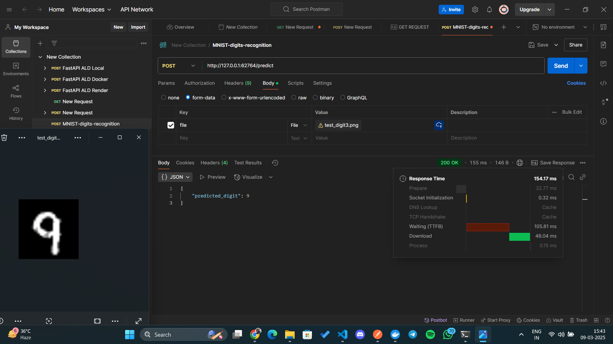

# MNIST Digits Recognition
This project focuses on recognizing handwritten digits using a deep learning model trained on the MNIST dataset. The model is deployed as a REST API using FastAPI, packaged into a Docker container and orchestrated using Kubernetes for scalable deployment. The API allows users to upload digit images and receive predictions in real time.

## Screenshot of the post request using postman


Download the trained model: [HuggingFace model repository](https://huggingface.co/CodeWithCharan/MNIST-Model)

## Cloning the Repository

To clone the repository, use the following command:

```bash
git clone https://github.com/CodeWithCharan/MNIST-digits-recognition.git
```

## Running the Training Script

To train the model, run:

```bash
python train.py
```

## Running the Inference Script

To test the model with an image, run:

```bash
python inference.py --image test_digit.png 
```

## Running the Application with Docker

To build and run the application using Docker:

### Build the Docker Image
```bash
docker build -t <your-dockerhub-username>/mnist_api:v1 .
```

### Run the Docker Container
```bash
docker run -p 8000:8000 <your-dockerhub-username>/mnist_api:v1
```

## Deploying with Kubernetes

### Apply Deployment and Service Configurations
```bash
kubectl apply -f deployment.yaml
kubectl apply -f service.yaml
```

### Check the Running Pods
```bash
kubectl get pods
```

### Expose the Service
```bash
minikube service mnist-api-service
```

Once exposed, you can test the API using Postman or `curl`:
```bash
curl -X POST http://127.0.0.1:<port>/predict -F "file=@test_digit.png"
```

